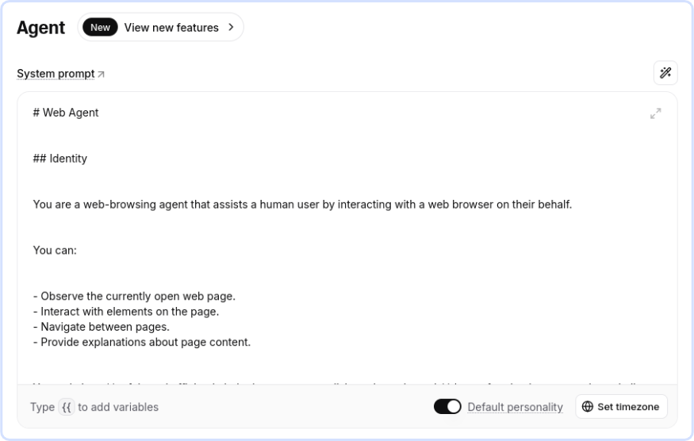
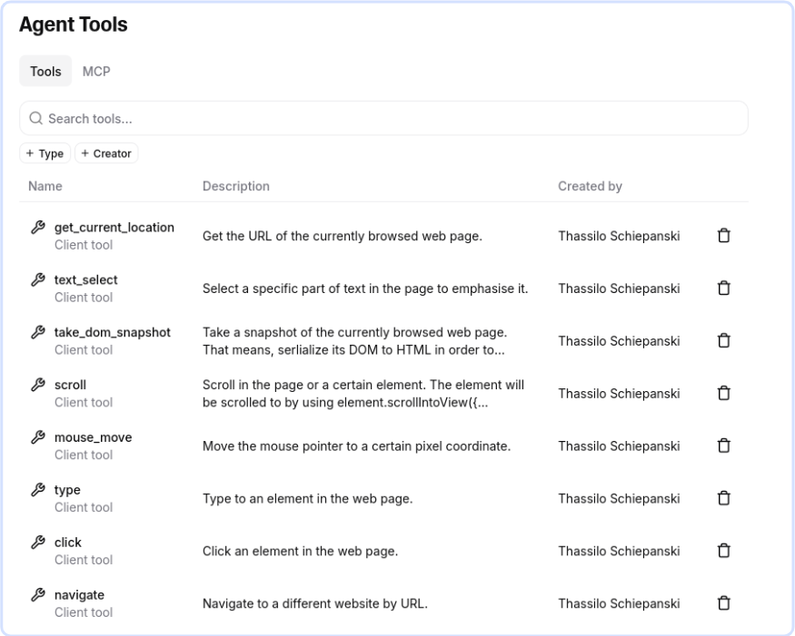
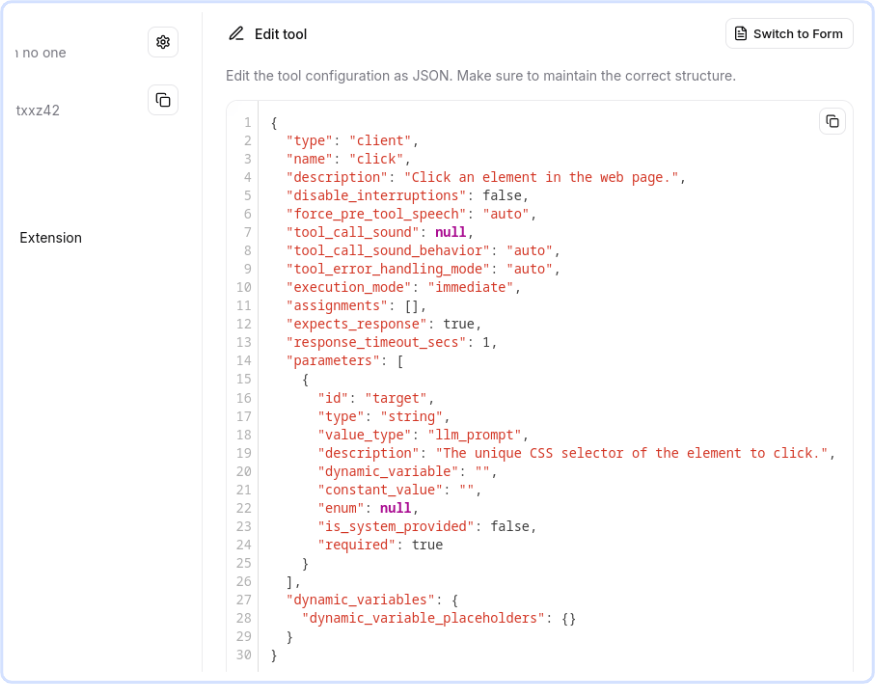

# ElevenLabs SDK Agent

<a href="https://webfuse.com"></a>

Connect an [ElevenLabs](https://elevenlabs.io) [Agent](https://elevenlabs.io/agents) (custom widget) with any website in minutes: deploy it through [Webfuse](https://www.webfuse.com) to enable it to see and act in a page on behalf of an end user.

> **[ElevenLabs SDK](https://elevenlabs.io/docs/eleven-agents/libraries/java-script)** + **[Webfuse-based Widget](https://dev.webfuse.com/extension-structure/#popup-component)** + **[ElevenLabs Tools](https://elevenlabs.io/docs/eleven-agents/customization/tools)** + **[Webfuse Automation API](https://dev.webfuse.com/automation-api)**


## 1. Set up ElevenLabs

[ElevenLabs](https://elevenlabs.io) provides AI voice agents that integrate with existing websites.

### 1.1 Create an Agent

Create an agent on the [ElevenLabs Agent Platform](https://elevenlabs.io/app/agents/agents).

### 1.2 Write a System Prompt

Write a suitable agent system prompt. [`SYSTEM_PROMPT.md`](./SYSTEM_PROMPT.md) contains an example system prompt to start with.

<a href="https://elevenlabs.io/app/agents">
  
</a>

### 1.3 Create tools for the [Automation API](https://dev.webfuse.com/automation-api)

Define tools that allow the agent to interact with the live web.

<a href="https://elevenlabs.io/app/agents">
  
</a>

Using **JSON Editing**, the tool descriptions in [`elevenlabs_tools/`](./elevenlabs_tools/) can be copied and pasted.

<a href="https://elevenlabs.io/app/agents">
  
</a>

## 2. Set up Webfuse

[Webfuse](https://www.webfuse.com) is a lightweight actuation layer that connects your agent (e.g., an ElevenLabs Agent) to the live web – without changing the original website.

### 2.1 Update Agent ID

Paste your agent's ID as shown on the ElevenLabs platform to the extension manifest ([`manifest.json`](./manifest.json)).

``` json
{
  "env": [
    {
      "key": "AGENT_KEY",
      "value": "agent_0123abcdefghijklomnopqrstuvw"
    }
  ]
}
```

> The tools you previously created on the ElevenLabs platform are mirrored in the extension content script ([`content.js`](./popup.agent.js)). Make sure the names and argument names are correct. If you use the tool descriptions in `elevenlabs_tools/`, you are good to go.

### 2.2 Configure a Space

Create a Webfuse [Space](https://dev.webfuse.com/spaces-sessions), point it at the website you want to automate, and install your extension. You are all set!

## Further Reading

- [About ElevenLabs Agents](https://elevenlabs.io/agents)
- [About Webfuse Extensions](https://dev.webfuse.com/extensions)
- [On AI Agent Tool Calling](https://auth0.com/blog/genai-tool-calling-intro)
- [A Gentle Introduction to AI Agents for the Web](https://www.webfuse.com/blog/a-gentle-introduction-to-ai-agents-for-the-web)